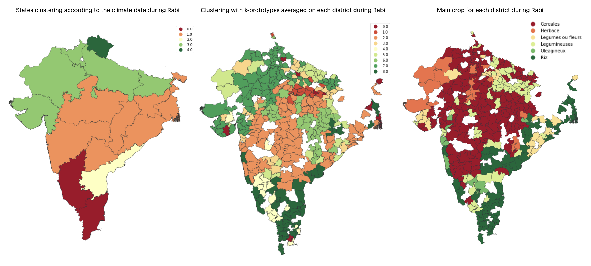

# **SCOR's Datathon 2022**

In this README you can find the description of our project of the 2022 [SCOR](https://www.scor.com/fr)'s Datathon.

Our approach was initially to cluster our data solely on the basis of productive losses using k-means. Observing that the clusters lacked interpretability, we had to develop a new methodology. We then adapted the k-prototypes algorithm by defining our own loss function on the categorical data. At the same time, we added to our data 2 categorical variables (the type of climate and the category of crop) using external datasets from [Copernicus program](https://cds.climate.copernicus.eu/cdsapp#!/dataset/reanalysis-era5-land-monthly-means?tab=form).
The result is a more robust model that solves the "performance vs interpretability" trade-off by fixing the cursor on demand.

Below is an example of clustering using our modified version of k-prototypes with penalization. On the left, the dominant climates by state. In the middle, the result of the clustering on Rabi. On the right, the main crops by district.

 <br />

<p align="center">
  
</p>
 <br />

## **1. Project Structure**

We provide the structure of our project in which you can find usable scripts but also exploration notebooks with comments. The notebook are listed below in the **read order**.

```
.
├── README.md
├── requirements.txt
├── exploration
    ├── free_clustering.ipynb: free administative clustering notebook
    ├── state_clustering.ipynb: state level clustering notebook
    ├── climate_data_clustering.ipynb: extracting climate clusters from Copernicus data

├── data
    ├── merged_data
    ├── external_data
        ├── climate_data: climate data from Copernicus
        ├── maps: maps data to plot our clusters 
        
├── output:
    ├── embeddings: embeddings of our climate clusters and our main crops
    ├── clusters: clusters of our models using our datasets
    ├── plot

├── predictions: containing the submision files
    ├── free: free level clustering predictions 
    ├── state: state level clustering predictions

├── src
    ├── clean.py
    ├── extractClusters.py
    ├── plot.py
    ├── utils.py

├── main_free_clusterization.py: main script that generates a free-admin clustering
├── main_state_clusterization.py: main script that generates a state clustering and fills the submission file
├── main_fill_submission_free_level.py: main script that fills the submission file with free-level clusters on our dataset

    
```
## **2. Installation**
In order to have the good environnement to run this code you need to the following instructions.

### **2.1 With conda (recommanded)**

- Install anaconda
````bash
brew install --cask anaconda
````

- Create an virtual environnement (optional)
```bash
conda create --name <env_name>
conda activate <env_name>
```

- Install all the needed dependencies
```bash
conda install --file requirements.txt
```
 <br />

### **2.2 With pip (not recommanded)**
- Create an virtual environnement (optional)
```bash
python -m venv <env_name>
source <env_name>/bin/activate
```

- Install all the needed dependencies
```
pip install -r requirements.txt
```
 <br />

### **2.3 Create a Jupyter kernel to run the notebooks**
- After being connected to ```<env_name>```
```bash
ipython kernel install --user --name=<env_name>
```
 <br />
 <br />

## **3 Usage**
### **3.1 Generate state level clusterization on our dataset and fill the submission file**

The structure to use the script is : 
```bash
python main_state_clusterization.py [-h] [--name_id NAME_ID] [--output_dir OUTPUT_DIR]
                                    [--nb_clusters NB_CLUSTERS] [--pen_state PEN_STATE]
                                    [--pen_crop PEN_CROP] [--pen_climate PEN_CLIMATE]
```

An example of use is :
```bash
python main_state_clusterization.py --name_id last --output_dir predictions/state/ --nb_clusters 4 --pen_state 1000000000 --pen_crop 10 --pen_climate 10
```

 <br />
 
### **3.2 Generate free level clusterization on our dataset**
The structure to use the script is : 
```bash
python main_free_clusterization.py [-h] --season SEASON --root ROOT --preds_path PREDS_PATH
                                   [--name_id NAME_ID] [--output_dir OUTPUT_DIR] --algo ALGO --k
                                   K --pen PEN [PEN ...]
```

An example of use is :
```bash
python main_free_clusterization.py --season Kharif --name_id last --output_dir predictions/free/ --algo kproto --k 8 --pen 1 1
```
 <br />

### **3.3 Fill the submission file for free level**

The structure to use the script is : 
```bash
python main_fill_submission_free_level.py [-h] --season SEASON --preds_path PREDS_PATH
                                          [--name_id NAME_ID] [--output_dir OUTPUT_DIR]
                                          [--empty_file_dir EMPTY_FILE_DIR]
```

An example of use is :
```bash
python main_free_clusterization.py --season Kharif --name_id last --output_dir predictions/free/ --algo kproto --k 8 --pen 1 1

```
